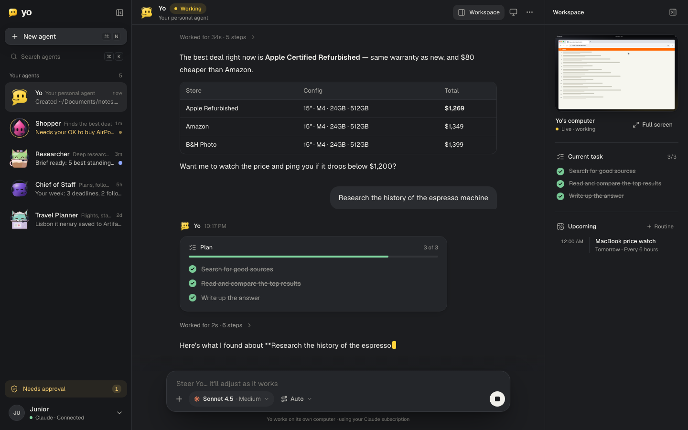
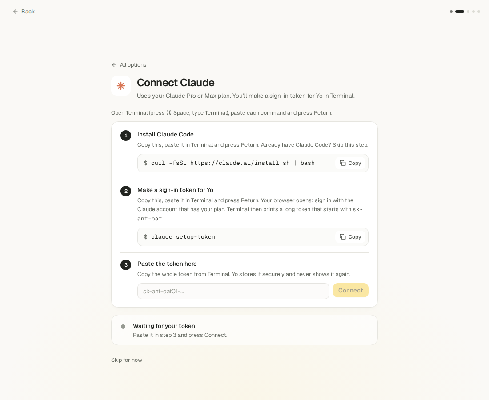
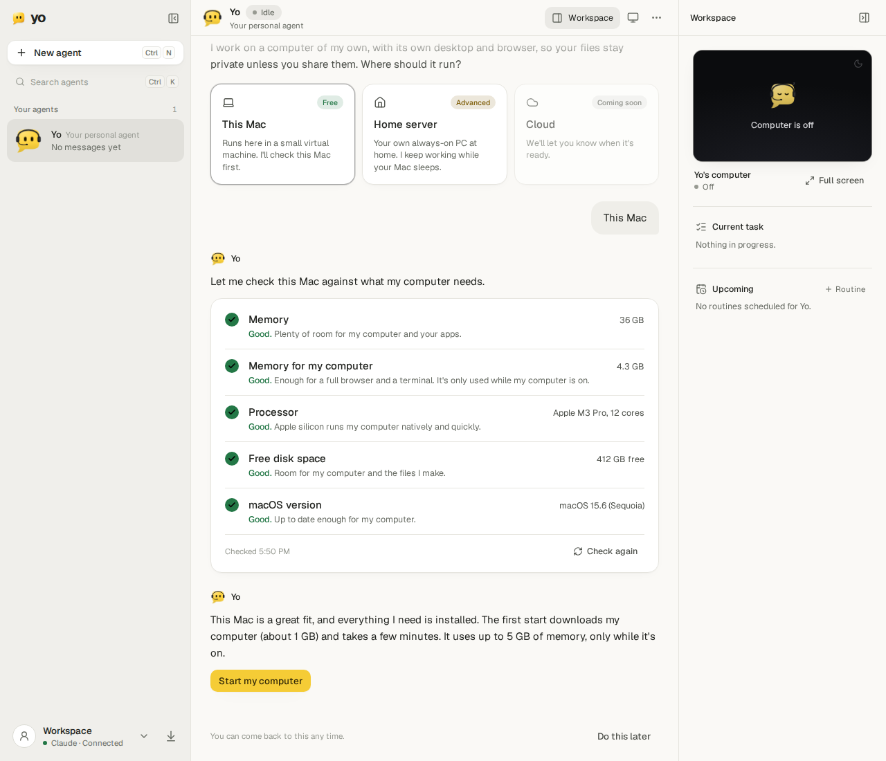

# Yo

**Your AI, your subscription, its own computer.**

Yo is a Mac app for personal AI agents. Each agent works on **a computer of its own**: a private Linux desktop
with a real Chromium browser, a terminal and files, running in a small virtual machine on your Mac (or on a PC
at home). It never touches your browser or your files unless you share them, and you can watch its screen live
and **Take over** whenever it needs a login or a 2FA code.

It runs on **the Claude or ChatGPT plan you already pay for** (Claude Pro/Max through Claude Code, or ChatGPT
through Codex). No API key and no extra cost. You can switch any agent between the two at any time, and it
keeps its memory and history.



- [What you need](#what-you-need)
- [Install](#install)
- [Connect your model](#connect-your-model)
- [The first agent sets up its computer](#the-first-agent-sets-up-its-computer)
- [Updates](#updates)
- [Build it from source](#build-it-from-source)
- [Support Yo ($10)](#support-yo-10)
- [License](#license)

## What you need

- **A Mac with Apple silicon** (M1 or newer). The download is built for Apple silicon only.
- **A Claude Pro/Max or ChatGPT subscription.** Claude and ChatGPT are the two supported models.
- For the agent's computer on this Mac (the app checks each of these for you, in plain words, before it starts
  anything; the reasons and sources are in [docs/REQUIREMENTS.md](docs/REQUIREMENTS.md)):

| | Minimum | Recommended |
| --- | --- | --- |
| Memory (RAM) | 16 GB | 32 GB |
| Memory for the agent's computer (what's left after 8 GB for macOS and your apps) | 2 GB | 4 GB |
| Processor | Apple silicon, 4 cores | 8 cores or more (every M-series chip has them) |
| Free disk space | 10 GB | 20 GB |
| macOS | 13 Ventura | 15 Sequoia or newer |
| Free tools | Homebrew, Colima and the Docker CLI (the app shows the install commands) | |

The agent's computer uses up to 4 CPUs, 5 GB of memory and a 20 GB disk, only while it's on. Quitting Yo
(⌘Q) stops it and gives the memory back.

## Install

**Set up with your agent.** If you use Claude Code or Codex, give it this one line and it installs Yo for you,
asking before it changes anything:

```text
Set up Yo for me. Follow the setup prompt at https://github.com/JuniorSua/yo-app/blob/main/SETUP_PROMPT.md
```

**Or by hand:**

1. On the [latest release](https://github.com/JuniorSua/yo-app/releases/latest), download the file ending in
   **.dmg** (Yo-&lt;version&gt;-arm64.dmg: that's the app; you can ignore the other files). Open it and drag
   **Yo** into **Applications**.
2. **The first open.** Yo is open source and signed ad hoc, not notarized by Apple (that needs a paid Apple
   Developer ID), so macOS warns the first time ("Apple could not verify “Yo” is free of malware…").
   - **macOS 15 Sequoia and later:** open Yo and click **Done** on the warning. Then open
     **System Settings → Privacy & Security**, scroll down to "Yo was blocked…", click **Open Anyway**, then
     **Open Anyway** again and enter your Mac password. (Right-click → Open no longer skips the warning there.)
   - **macOS 13 or 14:** in Applications, **right-click Yo → Open**, then **Open** again.

   Or, on any version (and if macOS says Yo "is damaged"), run this once in Terminal, then open Yo normally:

   ```bash
   xattr -dr com.apple.quarantine /Applications/Yo.app
   ```

**After an update**, macOS may ask whether Yo can use its confidential information stored in
**“Yo Safe Storage”** (Yo's saved login in your Keychain). Each ad-hoc signed version has a new signature, so
macOS checks once per update. Enter your Mac password and click **Always Allow**; Yo waits on a "Waiting for
macOS Keychain…" page until you do.

Yo lives in the menu bar: closing the window keeps your agents running. ⌘Q quits.

## Connect your model

On first launch Yo walks you through connecting your plan. It first looks for a Claude Code or Codex sign-in
that's already on your Mac and offers to use it. Otherwise pick one; each takes about two minutes, with the
commands in copy boxes and a status that turns green when Yo sees the connection.



**Claude** (Pro or Max):

1. Install Claude Code, if you don't have it: `curl -fsSL https://claude.ai/install.sh | bash`
2. Make a sign-in token for Yo: `claude setup-token`. Your browser opens; sign in with the account that has
   your plan. Terminal prints a long token starting with `sk-ant-oat`.
3. Paste the token into Yo and press **Connect**. Yo keeps it in its secret store and never shows it again.

**ChatGPT** (through Codex):

1. Install Codex, if you don't have it: `npm install -g @openai/codex` (or `brew install --cask codex`)
2. Sign in with ChatGPT, just for Yo:
   `mkdir -p ~/.yo/codex && CODEX_HOME=~/.yo/codex codex login`. It's a separate sign-in in its own folder, so
   the Codex sign-in you already use keeps working.
3. Yo notices the sign-in by itself and turns green.

You can connect the other one later in **Settings → Accounts**, and pick the account and model per agent from
the model picker under the message box.

## The first agent sets up its computer

Once a model is connected, your first agent opens with: *"Looks like we have a model connected. Let's set up my
computer."* It offers three places to run it:

- **This Mac** (free): it checks this Mac against the requirements above (pass, warn or block, each in plain
  words), shows the copy-paste commands for anything missing (Homebrew, then
  `brew install colima docker docker-compose`), starts its computer and confirms it's live. The first start
  downloads the computer (about 1 GB) and takes a few minutes.
- **Home server** (advanced): Yo's core and the agent's computer run on your own always-on PC at home (Linux,
  or Windows with WSL 2), so your agents keep working while your Mac sleeps. The agent walks you through it
  step by step; the Mac reaches the PC over SSH, and nothing is exposed to the internet.
- **Cloud**: coming soon.



## Updates

Yo checks GitHub Releases for a newer version. When there is one, the update button (bottom left) says
**"Yo 0.1.N is available: Download"**, which downloads the new .dmg in your browser: open it and replace the
app in Applications. Your agents, their memory and your settings stay. (Ad-hoc signed apps can't update themselves in
place on macOS, so Yo only points you at the download.)

## Build it from source

For contributors. You need a Mac with Apple silicon, Node 22 (see `.nvmrc`), pnpm 9 (`corepack enable`
picks the right version), and Xcode's command line tools for the small Swift helper.

```bash
git clone https://github.com/JuniorSua/yo-app.git && cd yo-app
pnpm install
pnpm --filter @yo/core --filter @yo/web build
pnpm app:build                 # builds Yo.app and installs it in /Applications
```

A build from this repo follows the public releases for updates, and pulls the agent's computer for its version
from `ghcr.io/juniorsua/yo-computer`.

For working on Yo itself:

```bash
pnpm check                     # typecheck + lint + unit tests
pnpm e2e                       # Playwright UI tests against the in-browser mock backend
pnpm --filter @yo/web dev:mock # the UI alone, with the mock backend
pnpm dev                       # core (watch) + web (Vite) at http://127.0.0.1:5173
pnpm computer:build            # build the agent's computer image yourself (needs Docker)
```

How it fits together:

```
Yo.app (Electron) ── starts ─▶ yo-core (Node, SQLite, 127.0.0.1:7777) ◀── web UI (React)
                                   │  token-authed WebSocket, loopback only
                                   ▼
                   Colima VM ▶ yo-computer container (127.0.0.1:7801)
                               agentd ─ Claude Agent SDK / Codex app-server
                                      ─ per-agent desktop + headed Chromium + VNC
                                      ─ MCP tools: browser, desktop, Yo (memory, approvals, …)
```

- **The model's tools run inside the agent's computer**, so its shell and file tools act on that machine only.
- **Yo owns each agent's identity**, memory, scratchpad and history. That's what lets an agent move between
  Claude and ChatGPT and stay itself.
- **Consequential actions** (purchases, sending messages, posting, credentials) wait for your approval. Logins
  and 2FA codes are handed to you with Take over.
- **Free, local, private.** Colima (MIT), the Docker CLI and Debian/Chromium are free. Nothing runs in anyone's
  cloud except the model calls your own subscription makes. Credentials stay in your macOS Keychain and inside
  the agent's VM, never in logs.

| Path | What |
| --- | --- |
| `apps/desktop` | Electron shell (and the Swift helper for Mac access) |
| `apps/core` | Control plane: agents, sessions, approvals, memory, routines, secrets |
| `apps/agentd` | Daemon inside the agent's computer: provider adapters, displays, VNC, terminal, files, MCP |
| `apps/web` | UI (React 19, Tailwind v4, zustand, noVNC, xterm) |
| `packages/contracts` | Shared protocol types and checks (UI ↔ core ↔ agentd) |
| `packages/avatar` | The Yo logo and the "Yo Buddies" avatars |
| `computer/` | The agent's computer image |
| `site/` | The website |

Contributing: [CONTRIBUTING.md](CONTRIBUTING.md). Security reports: [SECURITY.md](SECURITY.md).

## Support Yo ($10)

Yo is $10. Your $10 supports Yo's ongoing development and updates:
**[get Yo on the website](https://yo-app-five.vercel.app)**. Payments open soon; until then, download Yo from
[Releases](https://github.com/JuniorSua/yo-app/releases/latest) or set it up with your agent.

## License

Yo is licensed under the [Apache License 2.0](LICENSE). It builds on ideas and code patterns from T3 Code
(MIT), Rakazo (Apache-2.0) and noVNC (MPL-2.0); see [NOTICE](NOTICE).
